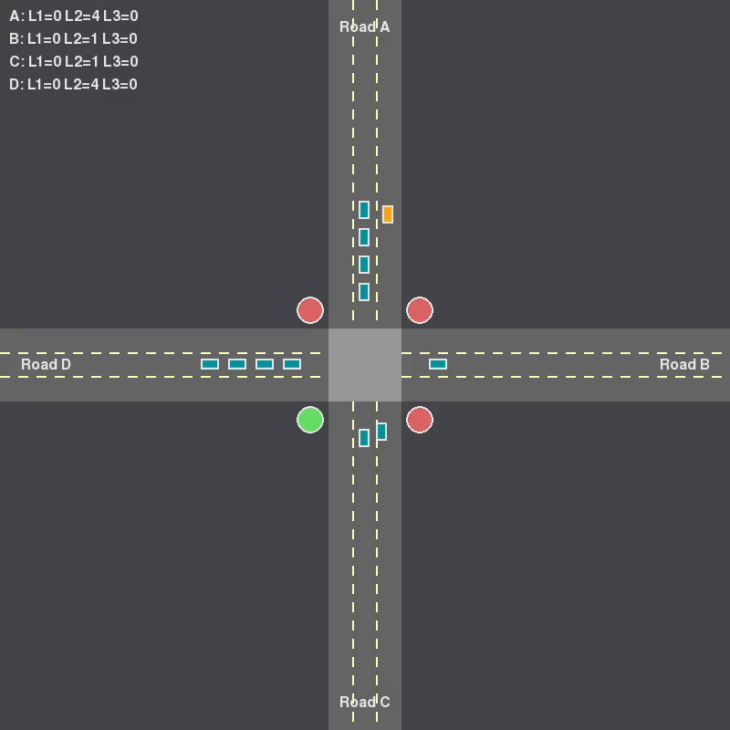

# dsa-queue-simulator

A multi-threaded traffic junction simulator implementing custom Queue and PriorityQueue data structures to manage vehicle flow at a four-way intersection. The system features dynamic priority-based traffic control where the AL2 lane automatically receives priority when congested, demonstrated through real-time Pygame visualization with smooth vehicle animations, lane-specific routing behaviors, and round-robin traffic light cycling with intelligent override capabilities.

---

## Author

- **Name**: Aaryan Khadka
- **Roll Number**: 38
- **Class**: CS-A, II/I
- **Subject**: COMP202

---

## GIF/Video



---

## Features

**Custom Data Structures**: Queue and Priority Queue implementations  
**Multi-threaded Architecture**: Concurrent file reading and vehicle processing  
**Dynamic Vehicle Spawning**: Vehicles enter from screen edges  
**Smart Traffic Management**: Round-robin light cycling with priority override  
**Priority Queue System**: AL2 lane gets priority when congested (≥10 vehicles)  
**Realistic Vehicle Movement**: Smooth animations with proper turning behavior  
**Real-time Visualization**: Live traffic display with Pygame  
**Lane-based Routing**: Different behavior for each lane type  

---

## System Overview

**traffic_generator.py**
- Generates random vehicles every second
- Writes vehicle data to `vehicle.data` file
- Format: `<vehicle_id>: <road>L<lane>`

**custom_queue.py**
- Implements Queue class (FIFO structure)
- Implements PriorityQueue class with congestion detection

**simulator.py**
- **FileReaderThread**: Monitors `vehicle.data` and spawns vehicles
- **VehicleProcessorThread**: Processes lane queues and moves vehicles
- **TrafficLightController**: Manages traffic light states and priority mode
- **TrafficGUI**: Renders visualization using Pygame

---

## Lane System

### Four-Way Junction
- **Road A**: Top (entering from North)
- **Road B**: Right (entering from East)
- **Road C**: Bottom (entering from South)
- **Road D**: Left (entering from West)

### Three-Lane System

| Lane | Color  | Behavior | Traffic Light Required |
|------|--------|----------|------------------------|
| L1   | Green  | Exit lane (removes vehicle) | No |
| L2   | Blue   | 50% straight, 50% right turn | Yes (must wait for green) |
| L3   | Orange | Always turns left | No (free flow) |

### Routing Tables

**Right Turn Mapping:**
- A → D, B → A, C → B, D → C

**Left Turn Mapping:**
- A → B, B → C, C → D, D → A

**Straight Mapping:**
- A → C, B → D, C → A, D → B

---

## Data Structures

| Data Structure | Implementation | Purpose |
|----------------|----------------|---------|
| **Queue** | Array-based FIFO structure using Python list with `enqueue()` (append to end) and `dequeue()` (pop from front) | Manages vehicles waiting in lanes L1 and L3, as well as regular lanes L2 for roads B, C, and D |
| **PriorityQueue** | Extends Queue class with congestion detection logic (`check_priority()` method) | Manages vehicles in Road A Lane 2 (AL2) with automatic priority activation when ≥10 vehicles and deactivation when ≤5 vehicles |

---

## Functions Using the Data Structures

**FileReaderThread.run()**
- Uses `queue_dict[road][lane].enqueue(vehicle)` to add newly spawned vehicles to their respective lane queues

**VehicleProcessorThread.process_l1_lanes()**
- Uses `l1_queue.dequeue()` to remove vehicles exiting the system

**VehicleProcessorThread.process_l2_lanes()**
- Uses `l2_queue.is_empty()` to check if vehicles are waiting
- Uses `l2_queue.dequeue()` to process vehicles when traffic light is green

**VehicleProcessorThread.process_l3_lanes()**
- Uses `l3_queue.is_empty()` to check for waiting vehicles
- Uses `l3_queue.dequeue()` to process left-turning vehicles

**TrafficLightController.update()**
- Uses `al2_queue.check_priority()` to determine if priority mode should be activated/deactivated
- Uses `al2_queue.size()` indirectly through check_priority()

**TrafficGUI.draw_vehicles()**
- Uses `queue.is_empty()`, `queue.dequeue()`, and `queue.enqueue()` to iterate through vehicles for rendering
- Uses `queue.size()` to display lane statistics

---

## Priority Queue System

### AL2 Priority Mode

**Activation Condition:**
- Triggers when AL2 (Road A, Lane 2) has **≥10 vehicles** in queue

**Behavior During Priority Mode:**
1. All traffic lights turn RED immediately
2. Road A light turns GREEN
3. Normal light cycling is suspended
4. AL2 vehicles are processed continuously
5. Visual indicator appears: "PRIORITY MODE: AL2 ACTIVE" (red text at top)
6. Console logs activation message

**Deactivation Condition:**
- Deactivates when AL2 drops to **≤5 vehicles**
- Normal round-robin light cycling resumes
- Console logs deactivation message

---

## Time Complexity Analysis

### Queue Operations

| Operation | Time Complexity | Explanation |
|-----------|-----------------|-------------|
| `enqueue(item)` | **O(1)** | Uses Python list `append()` which adds to the end in constant time (amortized) |
| `dequeue()` | **O(n)** | Uses `pop(0)` which removes from the front, requiring all remaining elements to shift left |
| `is_empty()` | **O(1)** | Simple length comparison |
| `size()` | **O(1)** | Returns length of list, a cached property in Python |
| `peek()` | **O(1)** | Direct index access to first element |
| `check_priority()` | **O(1)** | Only performs size comparisons and boolean operations |

### Traffic Processing Algorithm Complexity

**Per Processing Cycle (1 second interval):**

Total Time Complexity: O(n)
where n = total number of vehicles in moving_vehicles list

1. **L3 Lane Processing**: O(1) per road
   - 4 roads × O(1) dequeue = **O(4) = O(1)**

2. **L2 Lane Processing**: O(1) per road
   - 4 roads × O(1) dequeue + O(1) random = **O(4) = O(1)**

3. **L1 Lane Processing**: O(1) per road
   - 4 roads × O(1) dequeue = **O(4) = O(1)**

4. **Traffic Light Update**: O(1)
   - Priority check: O(1)
   - Light cycling: O(1)

5. **Moving Vehicles Update** (60 FPS): **O(n)**
   - Iterates through all moving vehicles: O(n)
   - Each vehicle update: O(1) position calculation
   - Enqueue when reaching destination: O(1)
   - Remove from list: O(n) worst case


---

## Prerequisites

### Required Software
- **Python 3.7+** (recommended: Python 3.8 or higher)
- **pip** (Python package installer)

### Required Libraries
- `pygame` - For graphics and visualization
- `threading` - Built-in Python module for concurrent execution

---

## Installation

### Step 1: Clone or Download the Project
```bash
git clone https://github.com/aaryankdk/dsa-queue-simulator
cd dsa-queue-simulator
```

### Step 2: Install Dependencies
```bash
pip install pygame
```

---

## How to Run

**Terminal/Command Prompt 1:**
```bash
python traffic_generator.py
```
This starts the vehicle generator that writes to `vehicle.data` file every second.

**Terminal/Command Prompt 2:**
```bash
python simulator.py
```
This starts the traffic simulator with visualization.

### Stopping the Programs
- **Simulator**: Close the Pygame window or press `Ctrl+C` in terminal
- **Traffic Generator**: Press `Ctrl+C` in its terminal window

---

## References

1. **Multi-threading in Python**
   - Official Documentation: https://docs.python.org/3/library/threading.html
   - Used for concurrent file monitoring and vehicle processing

2. **Pygame Documentation**
   - Official Site: https://www.pygame.org/docs/
   - Used for: Window management, drawing primitives, event handling, clock/FPS control
